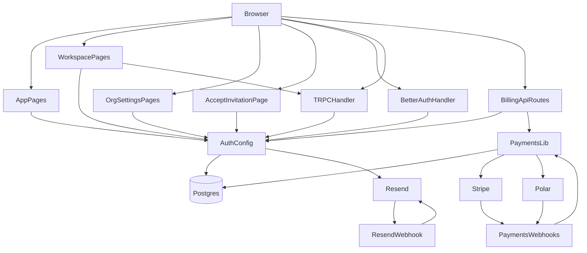

# Architecture

## System Overview

Genesis is a multi-tenant SaaS template built on Next.js App Router. It provides:

- Next.js App Router for pages and API handlers
- Better Auth for email/password authentication, organizations, invitations, and org-scoped RBAC
- Resend for verification and password reset email delivery
- Drizzle ORM for the Postgres schema and database access
- tRPC for typed server APIs
- Shared UI primitives and auth flows in `components/`
- Org-scoped dashboard and sharing tables as a reference workspace feature
- R2/S3-compatible object storage utilities for file uploads
- Provider-agnostic billing (Stripe or Polar) with a local Postgres billing mirror and webhook-driven sync
- Parallel guest-commerce checkout lifecycle for one-time purchases with claim-later account linking

## Routes

- `/` is the public landing page (redirects signed-in users to their workspace)
- `/reset-password` completes emailed password reset flows
- `/accept-invitation/[invitationId]` accepts Better Auth org invitations
- `/o/[orgSlug]` is the authenticated organization workspace
- `/o/[orgSlug]/settings` is the org-scoped administration surface
- `/api/auth/[...all]` hosts Better Auth endpoints
- `/api/trpc/[trpc]` hosts the tRPC entrypoint
- `/api/webhooks/resend` receives signed Resend webhook events
- `/api/billing/checkout`, `/api/billing/portal`, `/api/billing/access`, `/api/billing/sync` are authenticated billing helpers (delegate to `lib/payments/*`)
- `/api/payments/webhooks/stripe` and `/api/payments/webhooks/polar` receive provider billing webhooks (raw body + signature verification)
- `/api/commerce/checkout` and `/api/commerce/claim` handle guest one-time checkout and post-purchase claim linking
- `/sitemap.xml` and `/robots.txt` are generated from `app/sitemap.ts` and `app/robots.ts` (canonical host from `getSiteUrl()` in `lib/site-url.ts`)
- `/llms.txt` (optional curated site summary for some LLM crawlers) is served from `app/llms.txt/route.ts`

## Cross-Cutting Invariants

- Authentication is handled through Better Auth and server-side session reads, not custom cookie parsing.
- The tenant boundary is `organizationId`; cross-org access is not allowed.
- URL organization slugs are the user-visible workspace selector, while Better Auth active organization state is kept in sync.
- Auth enforcement uses three layers: `proxy.ts` for fast unauthenticated redirects, server route reads for session/org validation, and tRPC middleware for data access permission checks.
- Auth emails are sent through Resend and must not block the primary auth request lifecycle.
- Logging should use `@/lib/logger` with structured metadata instead of ad hoc `console.*` usage.
- Database access flows through the shared Drizzle setup in `lib/db`.
- External service clients should keep their protocol logic inside reusable `lib/<integration>/` modules, with Next.js and tRPC concerns kept in thin adapters.
- UI code should stay thin, with state and data flow owned intentionally near each entry point.
- Billing entitlements and plan limits for feature gating should read from the local billing read model (`lib/payments/read-model.ts`), not from provider SDK objects in the browser.
- Guest-commerce checkout/order state should live in local commerce tables and be finalized from webhooks, not browser redirect callbacks.
- **Public vs private indexing**: Marketing and other **public** pages inherit indexable defaults from `app/layout.tsx` (`metadataBase`, Open Graph). **Authenticated workspace** routes under `/o/[orgSlug]` set `robots` to `noindex, nofollow` in `app/o/[orgSlug]/layout.tsx`. Extend `app/sitemap.ts` only with URLs that should be discovered in search; keep app and API routes out unless product requirements say otherwise. Details: `docs/architecture/seo-and-geo.md`.

## Current Topology

## Source Map By Concern

- Frontend and UX
  - `app/layout.tsx`
  - `app/page.tsx`
  - `app/robots.ts`
  - `app/sitemap.ts`
  - `app/llms.txt/route.ts`
  - `app/not-found.tsx`
  - `app/reset-password/page.tsx`
  - `app/o/[orgSlug]/layout.tsx`
  - `app/o/[orgSlug]/loading.tsx`
  - `app/o/[orgSlug]/error.tsx`
  - `app/o/[orgSlug]/not-found.tsx`
  - `components/site-header.tsx`
  - `components/auth-modal.tsx`
  - `components/organization/organization-shell-hero.tsx`
  - `components/theme-toggle.tsx`
  - `components/theme-provider.tsx`
  - `components/ui/*`
- Authentication and security
  - `proxy.ts`
  - `lib/auth.ts`
  - `lib/auth-session.ts`
  - `lib/auth/permissions.ts`
  - `lib/auth-client.ts`
  - `lib/organization-server.ts`
  - `app/api/auth/[...all]/route.ts`
  - `app/accept-invitation/[invitationId]/page.tsx`
  - `server/trpc/context.ts`
  - `server/trpc/init.ts`
- API and RPC entry points
  - `app/api/trpc/[trpc]/route.ts`
  - `server/trpc/init.ts`
  - `server/trpc/router.ts`
  - `server/trpc/routers/dashboard.ts`
  - `server/trpc/routers/organization.ts`
- Email and webhooks
  - `lib/email/resend.ts`
  - `lib/email/templates.ts`
  - `app/api/webhooks/resend/route.ts`
- Payments and billing
  - `lib/payments/service.ts`
  - `lib/payments/read-model.ts`
  - `lib/payments/plans.ts`
  - `lib/billing-client.ts`
  - `app/api/billing/checkout/route.ts`
  - `app/api/billing/portal/route.ts`
  - `app/api/billing/access/route.ts`
  - `app/api/billing/sync/route.ts`
  - `app/api/payments/webhooks/stripe/route.ts`
  - `app/api/payments/webhooks/polar/route.ts`
- Commerce and guest checkout
  - `lib/commerce/service.ts`
  - `lib/commerce/provider-checkout.ts`
  - `lib/commerce/repository.ts`
  - `lib/commerce/catalog.ts`
  - `app/api/commerce/checkout/route.ts`
  - `app/api/commerce/claim/route.ts`
- Data model and storage
  - `lib/db/index.ts`
  - `lib/db/schema/index.ts`
  - `lib/db/schema/auth.ts`
  - `lib/db/schema/dashboard.ts`
  - `lib/db/schema/billing.ts`
- Shared runtime utilities
  - `lib/error-utils.ts`
  - `lib/logger.ts`
  - `lib/site-url.ts`
  - `lib/seo/home-json-ld.ts`
  - `lib/slug.ts`
  - `lib/try-catch.ts`
  - `lib/utils.ts`
  - `lib/uploads/r2.ts`

## Key Flows

### Auth Flow

1. The browser opens auth UI from `components/auth-modal.tsx`.
2. Client auth actions call Better Auth through `lib/auth-client.ts`.
3. Better Auth is configured in `lib/auth.ts` and exposed via `app/api/auth/[...all]/route.ts`.
4. Session-aware server code resolves auth lazily through `server/trpc/init.ts` middleware using cached helpers in `lib/auth-session.ts`.
5. Verification and password reset emails are generated through `lib/email/templates.ts` and delivered by `lib/email/resend.ts`.

### Organization Workspace Flow

1. Signed-in users create or switch organizations from `components/organization-switcher.tsx`.
2. Workspace routes under `/o/[orgSlug]` share `app/o/[orgSlug]/layout.tsx` (header + container) and load org membership and org-scoped permissions through `lib/organization-server.ts` (`requireOrganizationPageData` / `getOrganizationPageData`; underlying auth/org reads use React `cache()` in `lib/auth-session.ts`).
3. Workspace selection in `components/organization-switcher.tsx` updates Better Auth active organization state before route navigation.
4. Dashboard CRUD and sharing are enforced through `server/trpc/routers/dashboard.ts`.
5. Org settings flows call Better Auth organization APIs from `components/organization-settings.tsx`.

### Password Reset Flow

1. A user requests a password reset from the auth modal.
2. Better Auth sends a reset email through Resend.
3. The emailed link resolves through the Better Auth API handler and redirects back to `/reset-password`.
4. `app/reset-password/page.tsx` reads the token from the URL and submits the new password through the Better Auth client.

## Domain Docs

- `docs/architecture/auth-and-security.md`
- `docs/architecture/data-model-and-storage.md`
- `docs/architecture/frontend-and-ux-flows.md`
- `docs/architecture/payments-and-billing.md`
- `docs/architecture/commerce-and-guest-checkout.md`
- `docs/architecture/seo-and-geo.md`

## Update Protocol

When architecture-relevant behavior changes:

1. Update this file if the system overview, topology, invariants, or source map changed.
2. Add or update a focused file under `docs/architecture/` when a subsystem needs deeper explanation.
3. If crawl policy, canonical host, or major public routes change, update `docs/architecture/seo-and-geo.md` and `app/sitemap.ts` / route metadata as needed.
4. Record, at minimum:
   - what changed
   - why
   - impact
   - entry points
